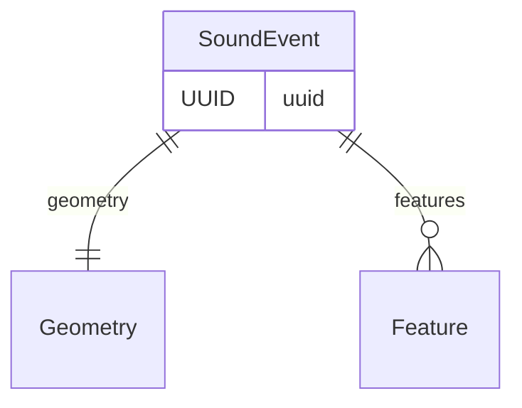
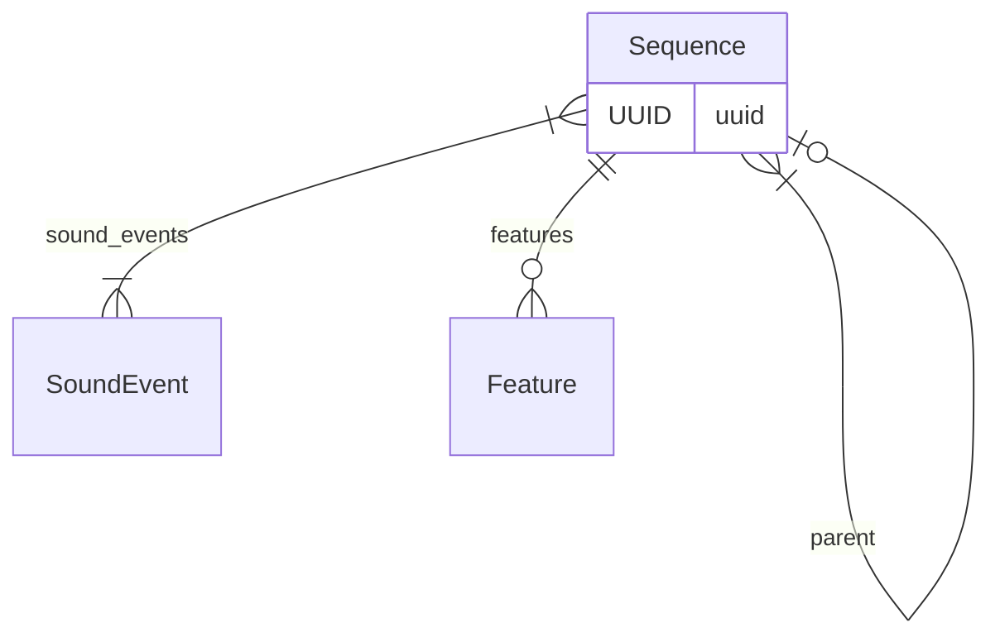
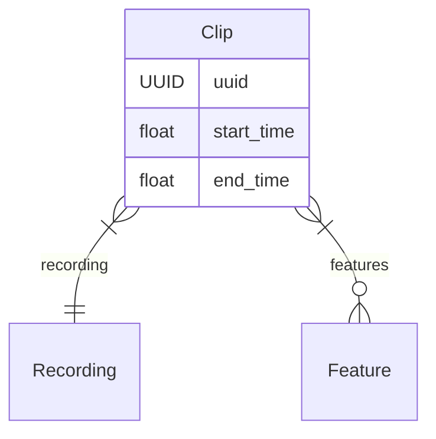

# Acoustic Objects

Now, we'll explore how `soundevent` handles various "objects" within the
acoustic content. To begin, **Geometry** objects offer a means to define regions
of interest in the time-frequency plane. **Sound events**, as acoustic objects
within the audio, are characterized by a geometry that delineates their
location. Additionally, `soundevent` introduces a method for specifying
**Sequences** of these **Sound events**. Let's delve deeper into these concepts:

## Geometries

In `soundevent`, [**Geometry**][soundevent.data.Geometry] objects are essential
for defining precise regions of interest in the time-frequency plane. The
package offers various geometry types, providing flexibility in delineating
regions of interest:

- [**TimeStamp**][soundevent.data.TimeStamp]: Represents a single point in time.

- [**TimeInterval**][soundevent.data.TimeInterval]: Describes a time interval,
  specifying both starting and ending times.

- [**Point**][soundevent.data.Point]: Pinpoints the exact location in time and
  frequency.

- [**LineString**][soundevent.data.LineString]: Describes an unbroken
  (potentially non-straight) line through a sequence of points.

- [**Polygon**][soundevent.data.Polygon]: Defines a closed shape in time and
  frequency, possibly with holes.

- [**BoundingBox**][soundevent.data.BoundingBox]: Represents a rectangle in time
  and frequency, offered separately due to its common use.

- [**MultiPoint**][soundevent.data.MultiPoint]: Describes a collection of
  points.

- [**MultiLineString**][soundevent.data.MultiLineString]: A collection of line
  strings.

- [**MultiPolygon**][soundevent.data.MultiLineString]: A collection of polygons,
  useful for demarcating regions of interest that are interrupted by occluding
  sounds.

!!! warning "Important Note on Time and Frequency Units"

    Pay careful attention to the units used in `soundevent` geometries. Time is
    uniformly measured in **seconds**, and frequency is represented in **hertz**.
    It's crucial to emphasize that all time values are consistently referenced
    **relative to the start of the recording**. Adhering to these standardized
    units ensures smoother development of functions and interaction with geometry
    objects, built on reliable assumptions.

!!! info "Understanding Geometry Objects in `soundevent`"

    `soundevent` adheres to the GeoJSON specification for structuring geometry
    objects. Every geometry object comprises a *type* field, indicating its
    specific geometry type, and a *coordinates* field defining its geometric
    properties. For further details and specifications, refer to the [GeoJSON
    Specification](https://geojson.org/).

## Sound Events

[**Sound Events**][soundevent.data.SoundEvent] take the spotlight in this
package, serving as the key players representing distinct sounds within the
audio content. These "events" unfold within specific time intervals and
frequency ranges, and the `soundevent` package ensures their precise
localization using handy **Geometry** objects.

Adding a layer of richness to these **Sound Events** is the ability to
characterize them through **Features**. These **Features** provide quantitative
insights into various acoustic properties, ranging from the basics like
duration, bandwidth, to peak frequency. You can attach any feature you fancy,
including those extracted by Deep Learning models!

## Sequences

A [**Sequence**][soundevent.data.Sequence] in `soundevent` is essentially a
collection of **Sound Events**, providing a flexible modeling tool that groups
multiple **Sound Events** with a unifying relation. Researchers have the freedom
to determine which **Sound Events** constitute a sequence, allowing them to
customize the structure based on their specific research requirements. The
**Sequence** object can specify a _parent_ **Sequence**, supporting hierarchical
arrangements, enabling the inclusion of subsequences and providing a
comprehensive representation of intricate relationships within complex
sequences. Similar to **Sound Events**, **Sequences** can be described using
**Features**, offering numerical insights into their acoustic properties.

## Clips

[**Clips**][soundevent.data.Clip] in `soundevent` represent distinct fragments
of a **Recording**, delineated by their _start_ and _end times_. Serving as
fundamental units for analysis and annotation tasks, **Clips** offer a more
computationally efficient approach, particularly when working with lengthy audio
files. Breaking down the **Recording** into manageable **Clips** not only
enhances computational efficiency but also supports focused analysis on specific
segments of interest. Standardizing **Clip** durations ensures consistency in
annotations across diverse **Recordings** and facilitates easier interpretation
and comparison of results in audio data. Many machine learning models process
audio files in **Clips**, reinforcing the practical adoption of the **Clip**
structure.

The exploration of a **Clip**'s content is facilitated through **Features**
attached to the **Clip**, providing numerical descriptors of its acoustic
content. These features can vary widely, encompassing
[Acoustic Indices](https://scikit-maad.github.io/features.html), simple
descriptors of overall acoustic information, or even abstract features derived
from
[Deep Learning models](https://www.google.com/url?sa=t&rct=j&q=&esrc=s&source=web&cd=&ved=2ahUKEwjP0tGqyt-CAxVsQkEAHTfeABQQFnoECBMQAQ&url=https%3A%2F%2Fwww.pnas.org%2Fdoi%2F10.1073%2Fpnas.2004702117&usg=AOvVaw2F_gXSQeIuS_Z3VUZqyB73&opi=89978449).
You have the freedom to choose features that align with the specific
requirements of your work, making it a flexible and customizable aspect of your
analysis.

???+ question "Understanding the Distinction between Clips and TimeInterval Sound Events"

    While both **Clip** objects and **TimeInterval Sound Events** share a
    common feature of being defined by a specific start and end time, their purpose
    and usage significantly differ. Generally, TimeInterval Sound Events are
    designed to emphasize a segment of the audio content that corresponds to a
    distinct and cohesive sound. In contrast, Clips have no such restriction; they
    represent a subset of a recording without a specific reference to a single
    sound event. Clips are typically considered to encapsulate the entire acoustic
    content, acknowledging that they may contain multiple sound events or none at
    all. Therefore, discussions about clips generally revolve around the entirety
    of the acoustic material rather than focusing on a particular sound instance.
