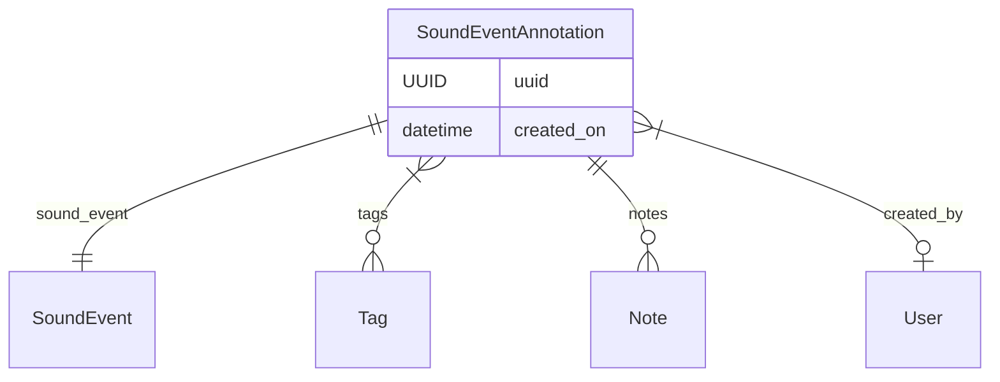
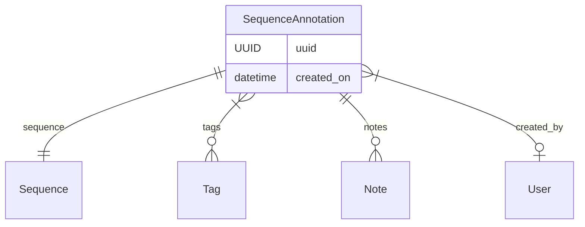
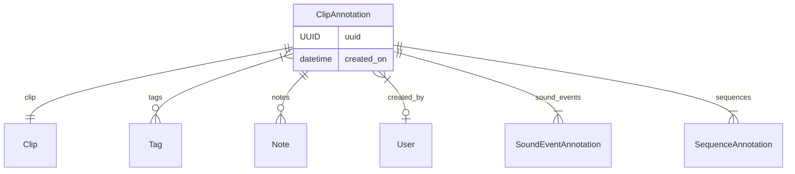
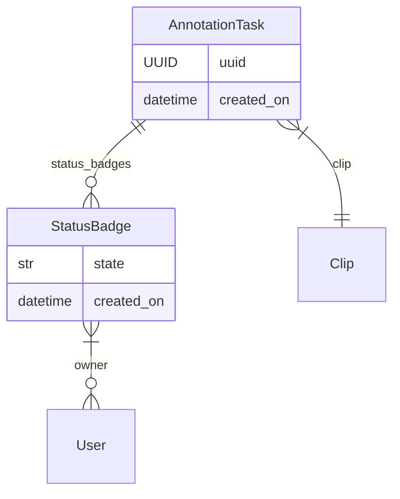
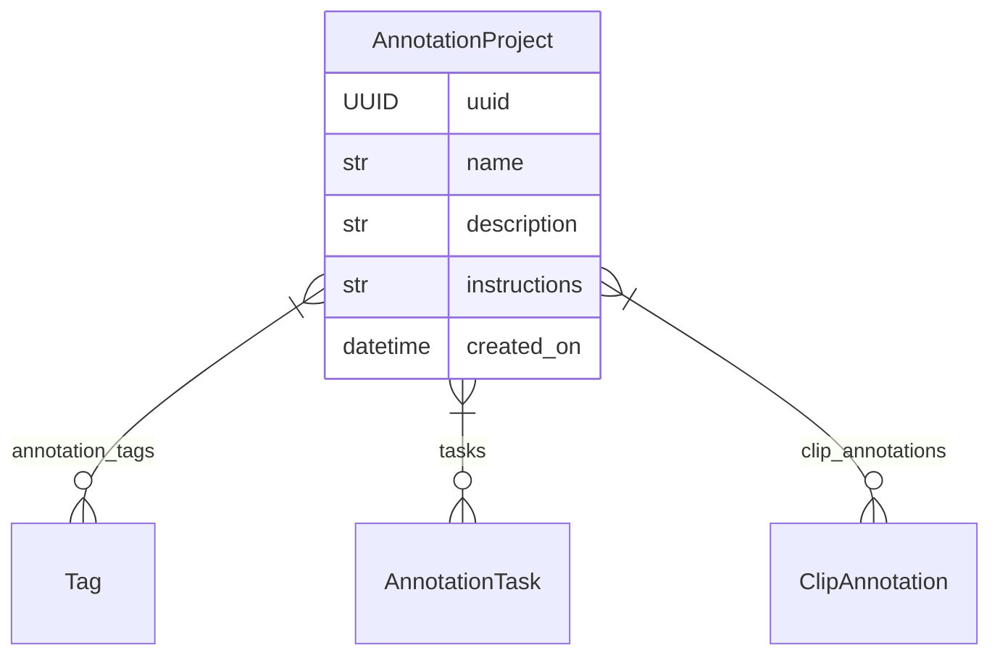

# Annotation

Deciphering the meaning of sounds within a recording can be a nuanced task.
Typically, it involves someone carefully listening to the audio and choosing
specific segments to highlight or describing the soundscape in a particular
manner.

In `soundevent`, we call this process "Annotation." It's about giving a human
interpretation to the sounds you've identified. You can annotate various sound
objects like **Clips**, **Events**, and **Sequences**. Annotations, in simple
terms, include **Tags** to categorize stuff, **Notes** for adding details or
thoughts about what the sound means, and info about who did the annotating and
when.

So, let's dive in and see how `soundevent` handles different types of annotated
objects.

## Sound Event Annotation

A [**SoundEventAnnotation**][soundevent.data.SoundEventAnnotation] object
encompasses all details about an annotated **Sound Event**, including a
reference to the _sound event_ itself (capturing the specific portion of sound),
attached _tags_ (for classifying the sound event), _notes_, information about
the _user who created_ the annotation, and the _timestamp_ of its creation.
Through annotations, a sound event gains a distinct interpretation, providing
clarity and context to the sound.

## Sequence Annotation

Moving beyond individual **Sound Events**, `soundevent` introduces **Sequence
Annotation**, a type of annotation applied to sequences of sound events. A
[**SequenceAnnotation**][soundevent.data.SequenceAnnotation] object encapsulates
details about the annotated sequence, referencing the particular _sequence_,
attaching relevant _tags_, providing _notes_ for additional insights or
interpretations, and recording information about the _annotating user_ and the
_creation timestamp_. Sequence Annotation extends the interpretive layer to
complex vocalization patterns, enhancing the understanding of structured sound
sequences.

## Clip Annotations

Expanding the scope of annotations, `soundevent` introduces **Clip
Annotations**, providing a way to annotate entire audio clips. The
[**ClipAnnotation**][soundevent.data.ClipAnnotation] object encompasses _tags_
and _notes_, offering additional insights into the overall acoustic content of
the clip. It retains information about the _annotating user_ and the _creation
timestamp_. Unlike sound event and sequence annotations, **Clip Annotation**
goes further by storing the list of **AnnotatedSoundEvents** found within the
clip, along with any **AnnotatedSequences**. This broader annotation approach
allows for a comprehensive understanding of the audio content encapsulated by
the clip.

## Annotation Task

When managing an annotation project, it's important to track which segments of
the entire dataset have undergone annotation. In `soundevent`, we use the
**Clip** as the fundamental unit for annotation tasks. Typically, annotators
focus on inspecting and listening to an audio clip, completing the necessary
annotations as part of the task. `soundevent` provides the
[**AnnotationTask**][soundevent.data.AnnotationTask] object, containing
essential details about the annotation task, including the _clip_ being
annotated, information about the _status of annotation_ (as indicated by
[**Status Badges**][soundevent.data.StatusBadge]), and additional information
like the _creation date_. This data not only facilitates tracking the progress
of annotations but also helps identify tasks in need of review or attention.

## Annotation Project

An [**Annotation Project**][soundevent.data.AnnotationProject] object in
soundevent consolidates all associated **Annotation Tasks** and the **Clip
Annotations** made within that project. It's essential to note that **Clip
Annotations** may encompass **Sound Event Annotations** and **Sequence
Annotations**, making the **Annotation Project** a comprehensive repository of
all annotated data related to the designated clips. In addition to _task_ and
_annotation_ details, the annotation project is characterized by a _name_,
serving to identify its purpose and content, and a _description_, providing
additional insights into the project's objectives and goals. A critical
component of the annotation project is the inclusion of _annotation
instructions_. The term "completing an annotation task" gains clarity and
relevance through explicit annotation instructions, guiding annotators on the
expectations, methods, and adherence to project standards and goals.

In the context of an **Annotation Project**, it is crucial to specify a set of
valid **Tags** that annotators can use. This practice ensures better control
over the information attached to the sound objects within the project. The
selection of these tags should align with the annotation goals, facilitating a
more focused and purposeful annotation process.

