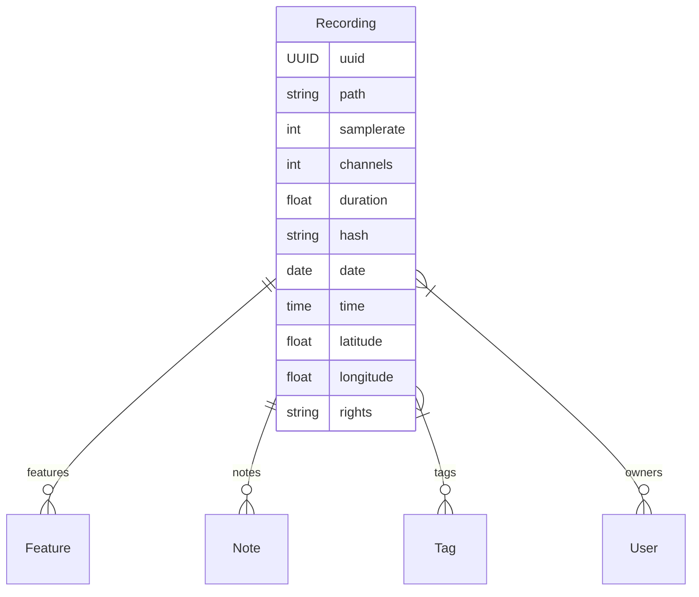
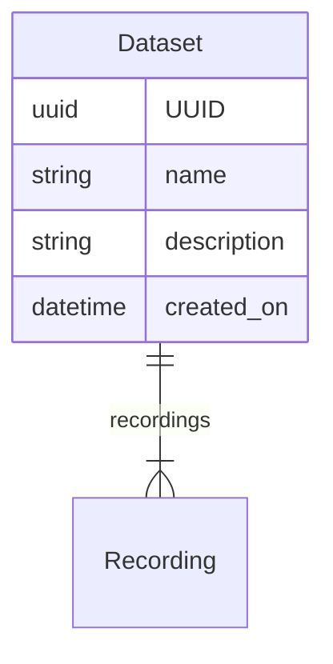

# Audio Content

## Recordings

A [**Recording**][soundevent.data.Recording] in `soundevent` is a singular audio
file, typically an unaltered capture of original audio recorded by a device.
Uniquely identified and linked to a file _path_, each **Recording** preserves
its authenticity.

Accompanied by metadata, **Recordings** reveal crucial details like _duration_,
_sample rate_, and the number of audio _channels_, providing technical insights
for accurate processing and analysis. Temporal and spatial context can be
enriched with _date_, _time_, _latitude_, and _longitude_ coordinates,
facilitating organization and comparison based on the time of capture and
geographical location.

Optionally, **Recordings** can include _ownership_ information, valuable for
compiling datasets and ensuring correct attribution. A _rights_ field specifies
usage permissions. Metadata can be further enriched with additional tags,
features, and notes. Tags offer categorical details like recording site or
equipment used, while features provide numeric values quantifying specific
characteristics. Notes contribute additional context, insights, or pertinent
details, fostering a deeper understanding of the recording.

??? note "Recording Hashes"

    **Recording** names can change, but their content remains the same. To ensure
    we can always recognize a specific recording, regardless of its name changes,
    we employ a helpful tool: the
    [*Hash*](https://www.cisa.gov/sites/default/files/FactSheets/NCCIC%20ICS_Factsheet_File_Hashing_S508C.pdf).
    In `soundevent`, we use the MD5 hashing function. Imagine it as a unique
    fingerprint for each file, derived solely from its content. This way, even if
    the name switches, the essence of the recording remains unmistakably
    identified.

??? note "Audiovisual Core Metadata Schema"

    In `soundevent`, we prioritize compatibility with established standards,
    specifically the [TDWG Audiovisual Core](https://www.tdwg.org/standards/ac/)
    metadata schema. All essential fields required by the schema are integrated
    into the **Recording** object. While there may be variations, particularly in
    the attachment of taxonomic terms, a thoughtful selection of **Tags** in
    `soundevent` enables a smooth alignment of most **Recording** fields with the
    Audiovisual Core's standardized terms. This ensures a cohesive collaboration
    within the metadata realm.

## Datasets

In `soundevent`, [**Datasets**][soundevent.data.Dataset] serve as purposeful
collections of related audio **Recordings**, sharing a unified context, like a
specific deployment or field study. Each **Dataset** receives a meaningful
_name_ and is accompanied by a _descriptive summary_, facilitating distinction
among multiple datasets. The suggested descriptive information should delve into
the dataset's origin, context, and relevance, enriching the understanding of its
content. Although `soundevent` doesn't enforce specific criteria for defining
datasets, maintaining cohesive audio collections is recommended. This practice
enhances source comprehension and enables more nuanced analysis of the dataset's
contents.

