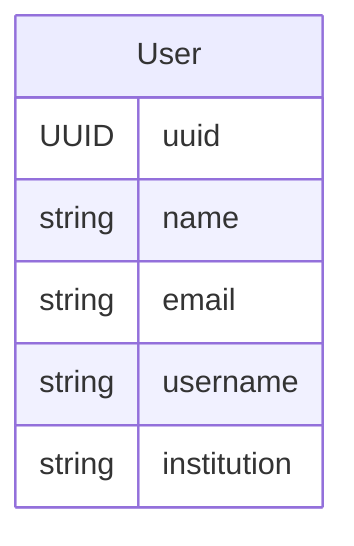
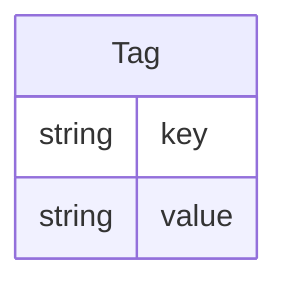
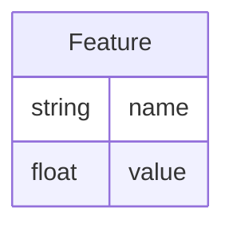
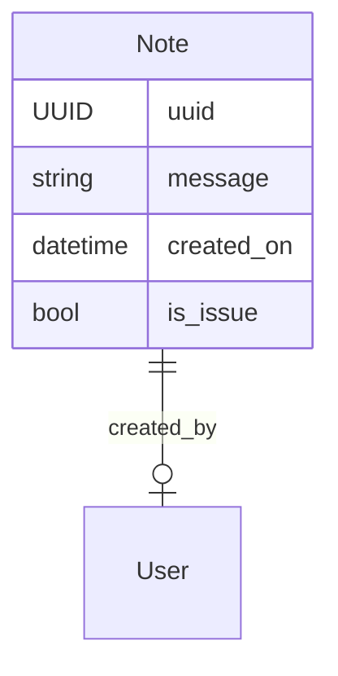

# Data Description

Let's delve into **users**, **tags**, **features**, and **notes** – the tools
that add depth to our bioacoustic research. Categorical tags, numerical
features, and freeform notes bring an extra layer of understanding to our
research objects, while user information provides adequate attribution
to the contribution of all involved.

## Users

Collaboration is at the heart of most bioacoustic analyses, involving data
collectors, annotators, reviewers, administrators, developers, and researchers.
To ensure proper attribution of work, soundevent introduces a
[**Users**][soundevent.data.User] data schema, holding minimal information about
each individual involved. The **User** object can optionally include a _name_,
_email_, _username_ (a commonly known alias), and _institution_. Recognizing the
sensitivity of this information, it's important to ensure that individuals are
comfortable sharing these details. If privacy concerns persist, User objects can
be omitted altogether.

## Tags

[**Tags**][soundevent.data.Tag] within the `soundevent` package are like
categorical variables that add specific meaning to the objects they adorn—be it
recordings, clips, or sound events. Serving as informative labels, **Tags**
offer a way to organize and contextualize data.

A **Tag** comprises two essential components: a _key_ and a _value_, both in the
form of simple text. While in many computational contexts, a **Tag** might be
considered just a text, we find it exceptionally beneficial to introduce a
_"namespace"_—the _key_—for each tag. This _key_ refines the meaning of the
**Tag** and establishes the context in which it is employed.

The beauty lies in the flexibility offered – there are no restrictions on what
can be employed as a _key_ or _value_. This flexibility accommodates
project-specific requirements, allowing researchers to tailor **Tags** to their
unique needs and objectives.

??? Note "What is a namespace?"

    Taken from the [Wikipedia article](https://en.wikipedia.org/wiki/Namespace)
    on namespaces:

    > a namespace is a set of signs (names) that are used to identify and refer
    > to objects of various kinds. A namespace ensures that all of a given set
    > of objects have unique names so that they can be easily identified.
    >
    > [...]
    >
    > namespaces are typically employed for the purpose of grouping symbols
    > and identifiers around a particular functionality and to avoid name
    > collisions between multiple identifiers that share the same name

## Features

[**Features**][soundevent.data.Feature] serve as numerical descriptions,
providing valuable information to the objects they enhance. They can encompass a
range of nature – from measurements of environmental sensors to attributes of
individuals creating a sound, even extending to abstract features extracted by
general-purpose deep learning models. When multiple **Features** accompany sound
events, clips, or recordings, they become tools for understanding similarities
and differences, allowing comparison and visualization in feature space.
**Features** play a pivotal role in outlier identification, gaining insights
into characteristic distribution, and enabling statistical analyses.

A **Feature** comprises a textual _name_ and a floating _value_. In
`soundevent`, lists of **Features** can be attached to various objects without
restrictions on the name or value. This flexibility allows for tailoring
features to specific project needs

## Notes

[**Notes**][soundevent.data.Note] serve as textual companions, allowing
communication among researchers and providing nuanced context to the objects
they accompany. Whether conveying vital information, engaging in discussions
about specific aspects of the attached objects, or flagging potential data
issues, **Notes** play an indispensable role in promoting collaboration and
enriching the overall understanding of audio data.

These textual _messages_, varying in length, also capture essential details such
as the note's _creator_ and the _time of creation_, ensuring proper recognition.
Beyond their informative role, **Notes** can be marked as _issues_ when
highlighting significant points requiring external review.

