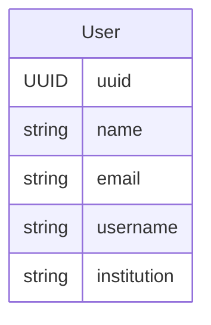
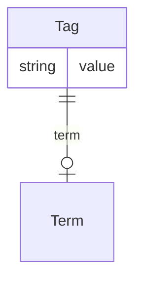
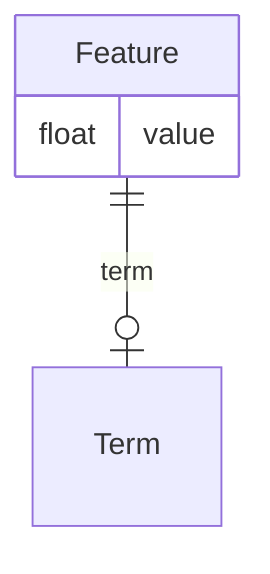
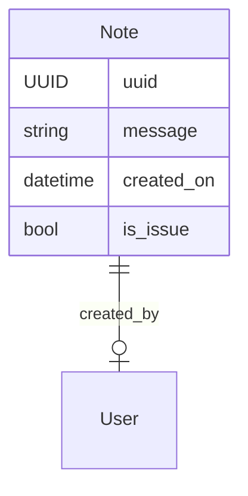

# Data Description

Let's explore **users**, **terms**, **tags**, **features**, and **notes** – essential tools for enriching bioacoustic research.
Controlled vocabularies (terms), categorical tags, numerical features, and free-form notes provide deeper context and insights into your research objects.
User information ensures proper attribution for everyone involved.

## Users

Bioacoustic analysis often involves collaboration between data collectors, annotators, reviewers, administrators, developers, and researchers.
To acknowledge contributions, soundevent introduces a [**Users**][soundevent.data.User] data schema, storing basic information about each individual.
The **User** object can optionally include _name_, _email_, _username_ and _institution_.
It's crucial to respect privacy and ensure individuals are comfortable sharing this information.
If concerns remain, User objects can be omitted entirely.

## Terms

[**Terms**][soundevent.data.Term] ensure everyone's on the same page.
Inconsistent naming like "species" vs. "Species" wastes time.
**Terms** provide a controlled vocabulary for common properties used in annotations and descriptions.

We've selected terms from established vocabularies like [Darwin Core](https://dwc.tdwg.org/list/) and [Audiovisual Core](https://ac.tdwg.org/termlist/), aligning your work with best practices.
Take a look here for the [terms][soundevent.terms] defined in soundevent.

## Tags

[**Tags**][soundevent.data.Tag] are informative labels within the `soundevent` package.
They add meaning to recordings, clips, or sound events, helping organize and contextualize data.

A **Tag** has two parts: a _term_ and a _value_.
The term acts as a namespace, refining the Tag's meaning and context.

You have the flexibility to use a term or not.
We strongly recommend it, but it's not mandatory.
This adaptability allows you to tailor Tags to your specific project needs.

??? Note "What is a namespace?"

    Taken from the [Wikipedia article](https://en.wikipedia.org/wiki/Namespace)
    on namespaces:

    > a namespace is a set of signs (names) that are used to identify and refer
    > to objects of various kinds. A namespace ensures that all of a given set
    > of objects have unique names so that they can be easily identified.
    >
    > [...]
    >
    > namespaces are typically employed for the purpose of grouping symbols
    > and identifiers around a particular functionality and to avoid name
    > collisions between multiple identifiers that share the same name

## Features

[**Features**][soundevent.data.Feature] are numerical descriptions.
They can include measurements from environmental sensors, attributes of sound-producing individuals, or even abstract features extracted by deep learning models.
**Features** enable comparison, visualization, outlier identification, understanding characteristic distributions, and statistical analysis.

A **Feature** consists of a **Term** and a numerical _value_.

## Notes

[**Notes**] are free-form textual additions, facilitating communication and providing context.
They can convey information, enable discussions, or flag data issues.

**Notes** can have any length and include the note's _creator_ and _time of creation_.
Notes can also be marked as issues to highlight points needing review.

