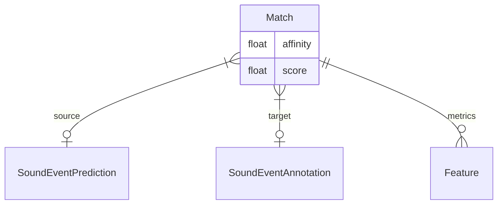
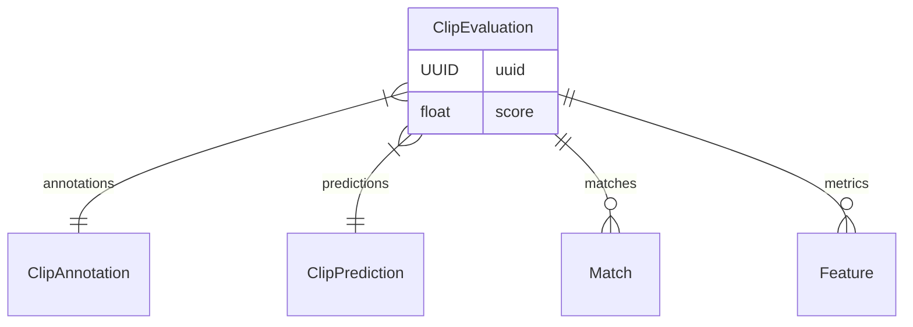
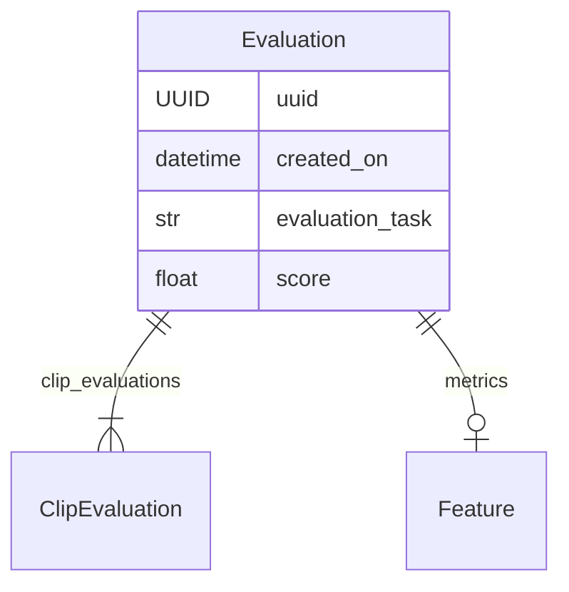
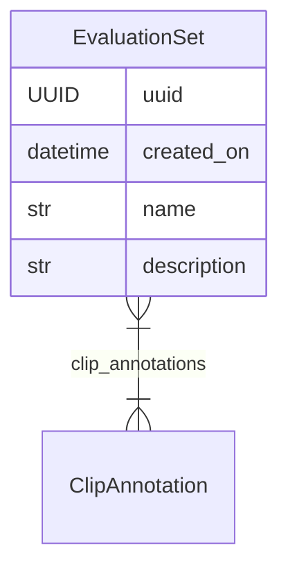

# Evaluation

In computational bioacoustics, a key aspiration is to effectively replicate and
automate the intricate analyses conducted by human experts. Achieving this goal
would represent a big step in scalability, enabling the exploration of vast
amounts of data and uncovering previously unexplored insights into animal
ecology and behavior.

To assess the success and reliability of automated methods, it is important to
establish evaluation criteria. `soundevent` provides specific objects that play
an important role in the evaluation process. This page delves into these
objects.

## Matches

When assessing a method's capability to accurately identify sound events in
audio, a common practice is to compare predicted sound events with the ground
truth. Regardless of the specific matching approach, the outcome typically
involves a set of matched and unmatched sound events. In response to this, the
soundevent package introduces the **Match** object to represent these scenarios.

A [**Match**][soundevent.data.Match] object comprises potentially empty _source_
(predicted) and _target_ (annotated) sound events, an _affinity_ score offering
a numerical measure of geometric similarity, an overall numeric _score_ for the
match, and a set of additional _metrics_. Notably, some predictions or ground
truth sound events may remain unmatched, and this is accommodated by creating a
**Match** object with either the source or the target (but not both) empty. The
additional metrics are essentially instances of **Features**, representing named
continuous values.

???+ question "Understanding Affinity and Score"

    Affinity serves as a measure of how well the geometries or regions of
    interest of two matched sound events align, disregarding any information about
    the semantic "meaning" of the sound. On the contrary, the overall score for the
    match incorporates this semantic information. For instance, there might be a
    predicted sound event whose geometry aligns with one of the ground truth
    events, but the assigned class is entirely incorrect. In such cases, a high
    affinity may be observed, but the score will be low due to the misalignment in
    semantic interpretation.

## Clip Evaluation

The [**ClipEvaluation**][soundevent.data.ClipEvaluation] object encapsulates all
information related to the assessment of a **Clip Prediction** in comparison to
the ground truth **Clip Annotations**. It includes details about all sound event
_matches_, whether matched or unmatched, along with an overall numeric _score_
for the entire prediction. Additionally, a list of supplementary _metrics_ is
provided, offering insights into various aspects of the prediction's
performance.

## Evaluation

The [**Evaluation**][soundevent.data.Evaluation] object serves as a collection
of _clip evaluations_, offering an overall _score_ along with additional
_metrics_. This object is designed to represent a model's performance across a
set of **Clips**, providing a means to assess its correctness and reliability.
As the evaluation of performance is context-dependent, the object includes an
_evaluation_task_ field, a text field providing a clear indication of the
specific task attempted by the predictions. This context ensures that the scores
and metrics provided have a well-defined meaning. For instance, examples of
evaluation tasks include "Clip Classification," where predictions aim to
accurately determine the "class" of each processed clip. While there are no
strict restrictions on this field, using standard names is recommended for
easier comparison between evaluations.

## Evaluation Set

An [**Evaluation Set**][soundevent.data.EvaluationSet] is a curated collection
of fully annotated clips designed for reliable evaluation purposes. Serving as a
comprehensive evaluation tool, it can be viewed as the equivalent of a benchmark
dataset. To facilitate understanding and usage, each evaluation set is
characterized by a _name_ and a _description_. The name provides a clear
identifier, while the description communicates essential information about the
contents and intended use cases of the evaluation set. This ensures that
researchers and practitioners can confidently employ the evaluation set to
assess the performance and reliability of various models and algorithms in a
standardized manner.

