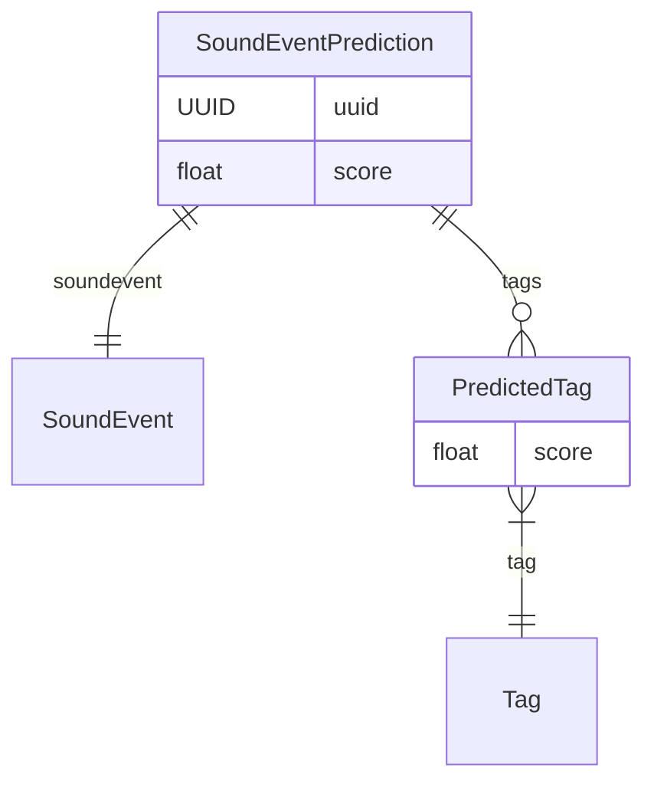
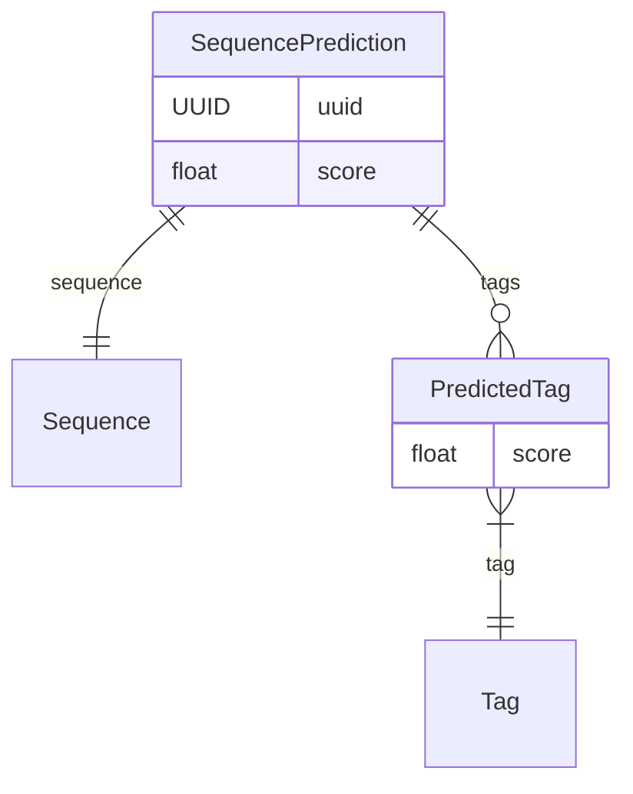
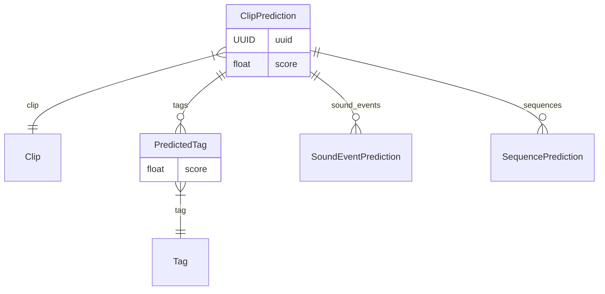
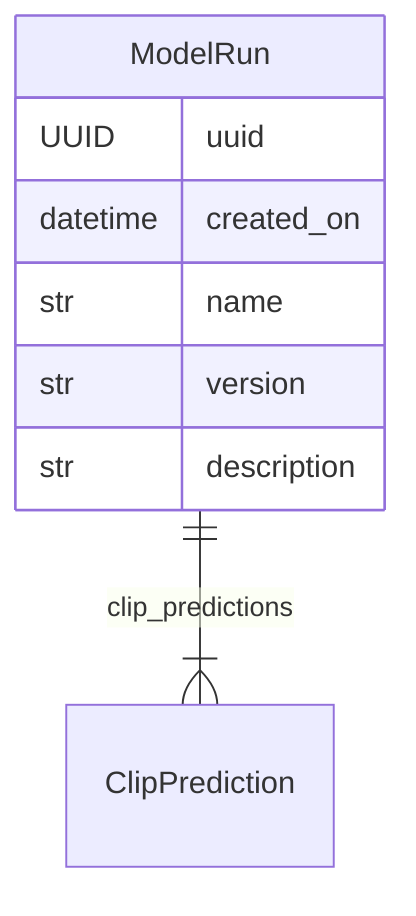

# Prediction

While **Annotation** involves expert human interpretation, often considered as
ground truth, in `soundevent`, we use the term **Prediction** to denote
interpretations derived through uncertain means, involving some level of
guesswork or uncertainty. These interpretations could be the outputs of
algorithms designed to automate the annotation task or even other individuals
providing speculative insights into the "truth" of the sounds they are
analyzing.

In `soundevent`, we introduce objects designed for discussing predictions:
**SoundEventPrediction**, **SequencePrediction**, **ClipPrediction**. These
entities store predictions that aim to estimate the true state of their
corresponding entities. All prediction objects share a similar structure,
providing a measure of uncertainty by storing an overall confidence _score_.
They also incorporate **PredictedTags**, resembling regular tags but with an
additional confidence _score_ assigned to each tag.

## Sound Event Predictions

The [**SoundEventPrediction**][soundevent.data.SoundEventPrediction] object
represents a single sound event predicted through uncertain means. This object
contains information about the predicted _sound event_, including an overall
confidence _score_, and a list of _predicted tags_ describing the anticipated
characteristics of the sound event.

## Sequence Predictions

The [**SequencePrediction**][soundevent.data.SequencePrediction] object
represents a predicted sequence of sound events. Much like Sound Event
Predictions, it encapsulates information about the _sequence_, offering an
overall confidence _score_ for the prediction and a list of _PredictedTags_.

## Clip Predictions

The [**ClipPrediction**][soundevent.data.ClipPrediction] object encompasses all
predictions made for the entire **Clip**, incorporating predictions for _sound
events_ or _sequences_. Like the preceding predictions, it retains fields for
the overall confidence _score_ and the _predicted tags_.

Interpreting predicted tags at the clip level is straightforward—they are tags
that apply to the entire acoustic content, proving beneficial for tasks like
sound scene classification. However, the interpretation of the score field
differs from sound event or sequence predictions. Rather than providing an
overall score for the confidence of sound event or sequence presence, the clip
score can serve to encode the confidence of a binary classification problem. A
low score indicates that the clip would not be considered a positive example in
the binary classification problem. It's important to note that the utilization
of scores to encode the necessary information is entirely at the discretion of
the user.

## Model Runs

The [**ModelRun**][soundevent.data.ModelRun] object in `soundevent` serves to
store collections of predictions originating from the same source. This object
includes a set of _predictions_ and provides details such as the model's _name_,
an optional _version_ (for precise method tracking), and a _description_ of the
method employed.

